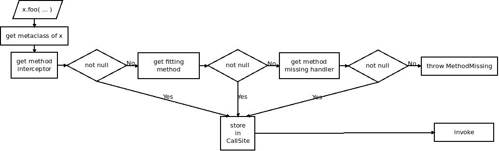

= GEP-11: Groovy 3 semantics and new MOP

:icons: font

.Metadata
****
[horizontal,options="compact"]
*Number*:: GEP-11
*Title*:: Groovy 3 semantics and new MOP
*Version*:: 4
*Type*:: Feature
*Status*:: Draft
*Leader*:: Jochen "blackdrag" Theodorou
*Created*:: 2012-06-26
*Last modification*&#160;:: 2018-10-28
****

== Abstract: Groovy 3 semantics and new MOP

For quite long we are thinking about a new MOP for Groovy, without finding the right way  to do it better this time.
It is difficult to find the right path between being user-friendly and efficient.
Thus the new MOP will contain some features the old did not, but will also remove some old features for
the sake of a more straight and more easy to understand MOP.

== Rationale

=== Removing default null argument

The default null argument is used for method calls that have one parameter,
but the call is done without an argument for the parameter.
Groovy will here use null, as long as the type of the parameter is not a primitive.
In case of a primitive the call fails. This feature was mainly added in the early Groovy pre 1.0 years
before Groovy supported default values for parameters. Another limitation of this logic is that it works
only with single parameter methods. There have been multiple cases of confused users by this logic.
Performance wise this logic doesn't cost much, and certainly not more than a call with a real argument.
But since this is a confusing feature of limited use, it should be removed.

=== Removing automatic list expansion

A method call done with a list that finds no matching method for that list (a method with one parameter of type List,
Collection, Object, etc), will cause a second method selection iteration. This time the list is "unpacked" and all
elements of the list are taken as if the method call had been done with the elements rather than the list.
Groovy also supports spreading of lists by an syntax element, making this automatic feature not needed.
In fact this can be quite surprising for users and is a problem for performance.
A spread version might be still not good in performance, but at least the user will have
to use an extra symbol and thus have the visual indicator. As of why this feature was originally added is unclear.
Looking at user code you will find barely intended usages of this. Thus it should be removed.

=== Changing Safe Navigation to stop evaluation

Currently an expression like a?.b.c will fail if a is null. It will not evaluate b, but it will try to evaluate c on null.
This defies the intend of safe navigation to avoid a NullPointerException. Thus this should be changed to stop the
evaluation of the path expression.

=== User Wish List

* Instance based Categories by Wujek Srujek +
Instead of having to provide a class with static methods it would be good to be able to feed an instance to the
use-construct and that then we will use this instance along with its instance methods. This allows instance state to be used.
* Replacing Introspector by blackdrag +
Not only because of bugs like GROOVY-5019 there should be a replacement of the Introspector

=== Some of the leading design ideas of this MOP

The plan is to orientate us a lot on the open call site caching the JVM provides with invokedynamic.
For this to work all parts of the MOP should no longer be seen as places that do invoke something,
but as places that return something, that then will be invoked. An invokeMethod then will for example
return instead an object that acts as a kind of handler, which can be invoked.
Groovy will then store it and avoid the reselection unless you invalidate it.
In the old MOP such caching often did not happen once you interact using meta programming.
The tasks to be solved in this are to provide an "extension point" for intercepting methods and to react to
missing methods, as well as being able to invalidate a cached version and/or to make an uncached version possible.

=== MOP2 outline



in meta class of x in pseudo code:

```
cachable = getMethodInterceptor(...)
if (cachable==null) cachable = getFittingMethod(...)
if (cachable==null) getMethodMissingHandler(...)
if (cachable==null) throw new MethodMissingException(...)
storeInCallSite(cachable)
invoke(cachable)
```

as an explanation to the methods:

* getMethodInterceptor +
Extension point for the user to register an interceptor, that will be used for all method calls.
This is equal what GroovyInterceptable does using invokeMethod, only that in MOP1 the method is directly called.
In MOP2 we will instead return a handler that then will do whatever is needed. This can for example be a method
handle to a invokeMethod method if wanted. TODO: define guards
* getFittingMethod +
Predefined way to select a method through meta class. This method will return an
object which then can be used to invoke the selected method.
* getMethodMissingHandler +
Extension point for the user to register a handler for missing methods.
The then invoked method is comparable to what methodMissing in MOP1 would be doing.
* MethodMissingException +
thrown if none of the above methods is bearing a non null result
* storeInCallSite +
Predefined method to store the cachable result of the above process in the call site.
As long as the cached object is valid the above methods will not be called again for this call site.
* invoke +
Predefined method to do the Initial invocation of the cachable. Subsequent invocation may be done directly by invokedynamic.

=== Context Meta Class

For the MOP2 Groovy will use a system of meta classes with a context element and an always existing default.
At each call site only one such view will be valid and it will be constant.
Those views can be used to defined "sealed" meta class, which won't get influenced by outside
meta classes or to allow for example calling private methods and not allowing them in other cases.
This makes 3 possible meta class variations currently:

* Default meta class +
Behaves pretty much like what Java allows in regards of method calls (same class private methods are available)
and all meta programming changes are visible
* Sealed meta class +
Like the default meta class, but meta programming changes from outside the class are not visible.
This can be especially useful to library writers.
* Test meta class (un)sealed +
Like the two before but with the addition that private members will always be available.

=== Getting a Meta Class

Because of the concept of context a class does not have one direct meta class that can be generated without its context.
The call site defines the place of the context. How the context itself is defined is a TODO.
As an implementation strategy it is possible to for example use ClassValue to store a table with the context being a key.
The key would probably have to be available as static information, or as easily computable information.
Since the resulting meta class could be stored later in the call site object context changes are to be avoided,
since it implies the invalidation of the call sites using that context.

=== General dispatch rule for methods (and properties)

To define the dispatch rules correctly we need to define some terms first: +
_Static Sender Class (SSC)_:  This is the static information about the class a call is made from.
If there is for example a class A and a class B extends A, and a call in a method in A,
then even if your instance is actually a B the SSC will still be A. +
_Inheritance based Multimethods_ (short multimethods from now on): Given a class A and a class B extends A,
a call made from within A may see a method defined on B as long as the method is visible (not private).
Groovy defines a special  exception to this though. If the method call from within A is calling a method of the name m,
then a m from B can only be visible if there is no private m defined in A.

Given those two definitions a method call in A will select the set of method to decide from based on this:
A call m() with the SSC A and done on an instance of B (extends A) will be using the methods defined in A, if A has a private m, otherwise the call is done using B.

Calls to Super: +
A call to super in B extends A will have the SSC B, but for the method selection process the super class of SSC (super(SSC)) will be used. In super calls mutimethods are not visible. Thus we can directly use the meta class super(SSC), but we will dispatch only on the public methods of that meta class.

=== Module Extension Methods Shadowing Rules

Module Extensions Methods are in the old and new MOP defined by the DefaultGroovyMethods related classes and module extension, like groovy-swing. In the definition here we will use the terms of from "inside" and from "outside" to define a callsite, that lies in the same class as the target method (inside) or not (outside). The general rules are:

* public methods are shadowed
* private methods are shadowed for outside callsites, but not for inside callsites

Subclasses of the class the module extension method has been applied to have these extended rules:

* if the subclass defines a private method of the same signature as the module extension method, then outside callsites will still see the extension method, inside callsites the private method
* A call to "super" or "this" will call the module extension method. As such the subclass is seen as outside callsite.

Open Blocks are not seen as separate classes.

=== Property Discovery

Currently MetaClass discovers properties based on the Java Beans conventions.
It also allows pseudo properties matching a convention on java.beans.EventSetDescriptor.
This allows the following trick in SwingBuilder for example:

```
button(actionPerformed: { println it })
```

The pseudo property actionPerformed is inferred from the single method exposed by ActionListener,
a type of listener that can be registered on a JButton. The code responsible for discovering these
properties is buried in MetaClassImpl and is not accessible to the outside.
It would be great if this mechanism be made pluggable.

=== The Realm concept

In MOP2 a Realm is a tree like structure containing the meta classes.
There is a root realm, used as default, but there can be any number of lower realms.
A meta class change is visible in a realm, if the change is done to the meta class in
the same realm or to a meta class in a higher realm.
Script execution engines are able to set a realm for example to prevent them changing meta classes they should not change.
This can be used for unit tests to isolate meta class changes done during the tests as well.
A library can have its own realm (defined through an annotation) to prevent other classes to
leak their changes into that library, while the library can still use a higher realm to make
changes more public visible, if the realm allows that. Realms can have a setting that prevents
code executed from there to make changes to higher realms. Calling a method is always done using
the meta classes from the current realm, even if the called class then calls other classes using
its own realm. A realm is thus not thread local structure, it is more of a lexical scope.
A realm can also use a different meta class flavor, to for example allow access to private methods and fields.

=== Work Items

This part is to guide the implementors with the course of action and planning of the subtasks.

* make indy the only compilation target in the build
* move all non-indy bytecode interfacing code to a module, which may be removed later. This includes ScriptBytecodeAdpater as well as all the custom call site caching classes
* make a new module for MOP2
* turn meta class into an immutable
* implement meta class views

=== Breaking changes trace

`groovy.lang.MetaObjectProtocol` (currently in `groovy.mop.MetaObjectProtocol`):

* `getProperties()` renamed to `getMetaProperties()`
* `getMethods()` renamed to `getMetaMethods()`
* `respondsTo(Object, String, Object[])` changed to `respondsTo(String, Object...)`
* `respondsTo(Object, String)` replaced by `getMetaMethods(String, Class...)` with the class argument being null
* hasProperty(Object,String) replaced by getMetaProperty(String) being null or not
* getStaticMetaMethod(String, Object[]) replaced by respondsTo(String, Object...) and inspecting the list for static methods
* getMetaMethod(name, Object[]) replaced by respondsTo(String, Object...) in case the arguments are no classes and getMetaMethods(String,Class...) in case of the arguments being classes
* invokeConstructor(Object[])NO REPLACEMENT
* invokeMethod(Object, String, Object[]) NO REPLACEMENT
* invokeMethod(Object, String, Object) NO REPLACEMENT
* invokeStaticMethod(Object, String, Object[]) NO REPLACEMENT
* getProperty(Object, String) replaced by MetaProperty#invoke
* setProperty(Object, String, Object) replaced by MetaProperty#invoke
* getAttribute(Object, String) replaced by MetaProperty#getField#invoke
* setAttribute(Object, String, Object) replaced by MetaProperty#getField#invoke
* `getMetaProperty(String)`, `getTheClass()` UNCHANGED

`groovy.lang.MetaMethod` is split into a public interface `groovy.mop.MetaMethod` and an internal default implementation `groovy.mop.internal.DefaultMetaMethod`.

Differences to groovy.mop.internal.DefaultMetaMethod:

* does no longer extend ParameterTypes and does no longer implement Clonable
* no protected fields nativeParamTypes, parameterTypes and isVargsMethod
* the constructor MetaMethod() and MetaMethod(Class[]) are removed and partially replaced by DefaultMetaMethod(Class, String, int, MethodHandle) and DefaultMetaMethod(Class, String, MethodType), which uses the MethodType or the MethodHandle to define the parameter classes
* coerceArgumentsToClasses(Object[]), correctArguments(Object[]), isValidExactMethod(Class[]), isValidExactMethod(Object[]), isValidMethod(Class[]), isValidMethod(Object[]), isVargsMethod(), isVargsMethod(Object[]) NO REPLACEMENT
* getNativeParameterTypes()replaced by getParameterClasses()
* equal(CachedClass[], CachedClass[]), equal(CachedClass[], Class[]), checkParameters(Class[]), clone(), doMethodInvoke(Object, Object[]), getDescriptor() NO REPLACEMENT
* getDeclaringClass(), getModifiers(), getName(), getReturnType(), isAbstract(), isPrivate(), isProtected(), isPublic(), isStatic(), toString() UNCHANGED
* getMopName(), getSignature(), invoke(Object, Object[]), isCacheable(), isMethod(MetaMethod), isSame(MetaMethod), processDoMethodInvokeException(Exception, Object, Object[]) NO REPLACEMENT

`groovy.lang.MetaProperty` is split into a public interface `groovy.mop.MetaProperty` and an internal default implementation `groovy.mop.internal.DefaultMetaProperty`.

Differences to groovy.mop.internal.DefaultMetaProperty:

* the public static field PROPERTY_SET_PREFIX is removed NO REPLACEMENT
* the protected fields name and type are now private and have to be requested through getName and getType
* getModifiers(), getName(), getType(), DefaultMetaProperty(String, Class) UNCHANGED
* getGetterName(String, Class), getSetterName(String)NO REPLACEMENT
* getProperty(Object) replaced by getter(boolean)
* setProperty(Object, Object) replaced by setter(boolean)

== References and useful links

* https://web.archive.org/web/20150508123746/http://docs.codehaus.org/display/GroovyJSR/GEP+11+-+Groovy+3+semantics+and+new+MOP[GEP-11: Groovy 3 semantics and new MOP] (web archive link)

=== Mailing-list discussions

* https://markmail.org/message/zujumywsb73px2ky[groovy-user: Groovy 3]

=== Reference implementation

* https://github.com/groovy/groovy-core/tree/GROOVY_3_FEATURE[GROOVY_3_FEATURE] +
feature branch on github

== Update history

3 (2013-10-11):: Version as extracted from Codehaus wiki
4 (2018-10-28):: Numerous minor tweaks
